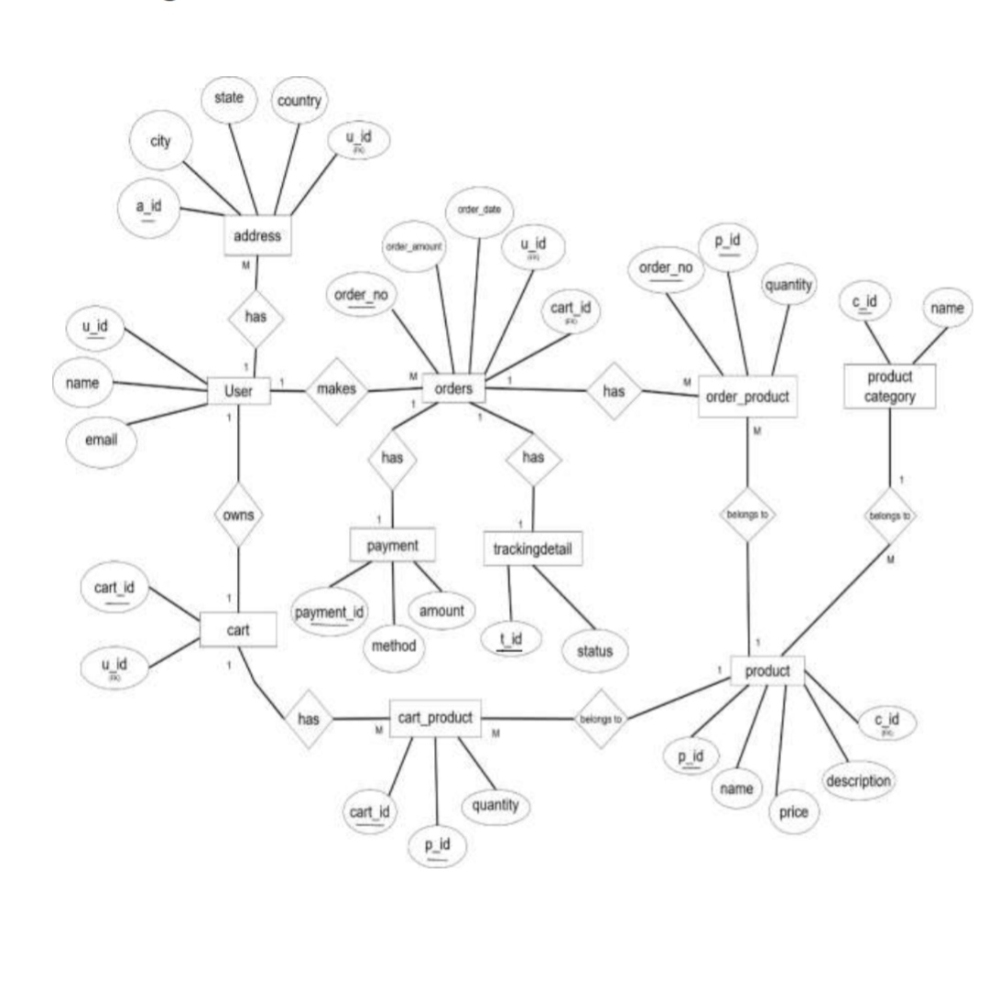

# E-Commerce Management System 🛒

## Overview

Designed a normalized database system for managing users, products, orders, payments, and delivery tracking in an e-commerce platform using PostgreSQL.

## Technologies Used

- PostgreSQL
- SQL
- DBMS

## Key Concepts

- ER Diagram
- Schema Design
- Database Normalization (3NF)
- Primary & Foreign Keys
- Data Integrity
- Relational Database Design

## Features

- User Management
- Product Management
- Cart Management
- Order Processing
- Payment Tracking
- Delivery Tracking

## ER Diagram

## Learning Outcomes

- Database Design
- SQL Query Writing
- Normalization
- ER Modeling
- PostgreSQL

## Project Report

📄 Complete documentation is available in `DBMP Report pdf 4.pdf`

## Author

Arya Pandurang Gawade
